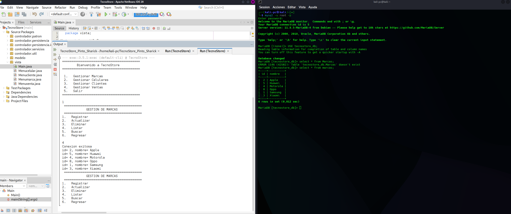
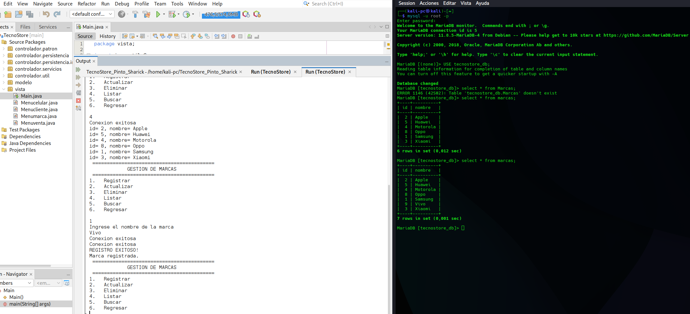
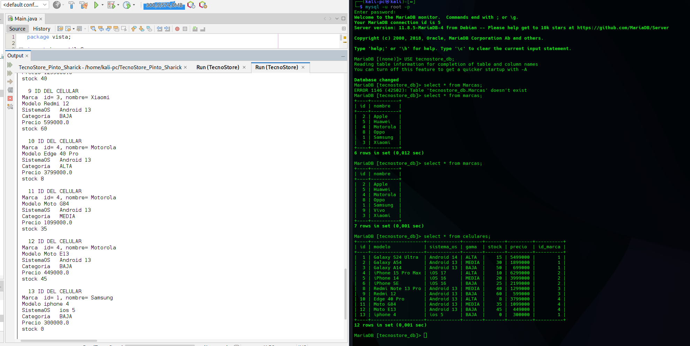
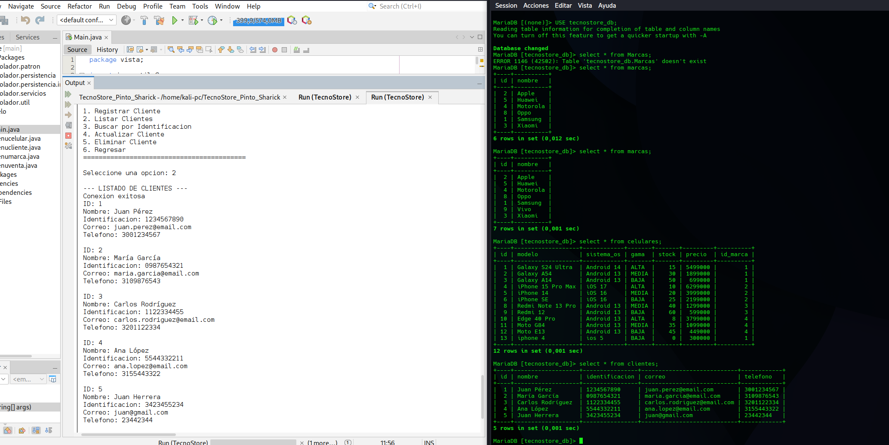
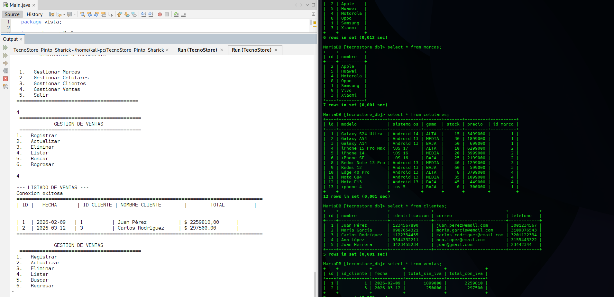

<h1 align=center>Java TecnoStore</h1>
 

 <h6 align=center>Proyecto Java: (Sharick Giovanna Pinto Rodriguez)</h6>

 <div align="center">


</div>

---

# Tabla de Contenido

<h6 align=center> 1. Introducción </h6>
<h6 align=center> 2. Caso de Estudio </h6>
<h6 align=center> 3. Descripción del Proyecto </h6> 
<h6 align=center> 4. Requerimientos </h6> 
<h6 align=center> 5. Estructura del Código (cómo está organizado) </h6> 
<h6 align=center> 6. Base de Datos (modelo y tablas) </h6>
<h6 align=center> 7. Persistencia JDBC (cómo se guarda todo) </h6> 
<h6 align=center> 8. Cómo Ejecutar (pasos cortos) </h6>
<h6 align=center> 9. Capturas </h6>


---
# Introducción

TecnoStore es una tienda minorista de celulares que llevaba el control de inventario, ventas y clientes de forma manual (o sea: Excel por todos lados, datos repetidos y errores).
La idea del proyecto es pasar eso a un sistema de consola en Java que permita:

 * manejar catálogo de celulares (CRUD),

* registrar clientes con validaciones reales,

* registrar ventas con IVA del 19%,

* descontar stock automáticamente,

* guardar ventas en MySQL usando JDBC,

* sacar reportes en consola usando Stream API,

* y generar un archivo reporte_ventas.txt con el resumen de ventas.

Aquí está documentado lo que se hizo en el proyecto, cómo está organizado el código, la base de datos y cómo se ejecuta.


---


# 2. Caso de Estudio

### El problema principal era el típico:

* datos dispersos (cada quien tenía su “versión” de inventario),

* stock mal llevado (venden y se les “olvida” restar),

* clientes repetidos (no hay identificación única),

* y reportes hechos manualmente, poco confiables.

La solución fue hacer un sistema simple pero serio: un menú central en consola, reglas claras (precio/stock, correo, IVA, etc.) y persistencia real en MySQL para que no dependa de la RAM.

---

# 3. Descripción del proyecto

Este proyecto tiene como objetivo diseñar y desarrollar un sistema para TecnoStore, una tienda de celulares que necesita dejar atrás el manejo manual en hojas de cálculo. La idea es construir una solución en Java (consola), apoyada por MySQL, que permita llevar un control más organizado, consistente y seguro de la información, evitando errores típicos como datos repetidos, registros incompletos o inventario mal calculado.

# 4. Requisitos Funcionales 

## Gestión de Celulares

* CRUD completo (registrar, actualizar, eliminar, listar).

* Campos: id, marca, modelo, precio, stock, sistema operativo, gama (Alta/Media/Baja).

* Validación: precio > 0 y stock >= 0.

## Gestión de Clientes

* Campos: id, nombre, identificación, correo, teléfono.

* Validación: correo con formato válido.

* Validación: identificación única (no se repite).

## Gestión de Ventas

* Registrar venta seleccionando cliente + celulares.

* Calcular total con IVA del 19%.

* Actualizar stock del celular vendido.

* Guardar venta y detalle en MySQL usando JDBC.

## Reportes

* Celulares con stock bajo (<5).

* Top 3 más vendidos.

* Ventas totales por mes.

* Los cálculos se hacen con Stream API + colecciones (no a mano).

## Persistencia y archivos

* Generar reporte_ventas.txt con resumen de ventas.

* Manejo de excepciones con try-with-resources.

## Patrones

* Se usa Strategy (descuento opcional) como extra del proyecto, sin romper los requisitos del enunciado.

---


# 5. Estructura del Código
#### La idea fue mantenerlo simple y práctico:

```
TecnoStore/
├─ src/
│  └─ main/
│     └─ java/
│        └─ tecnestore/
│           ├─ modelo/
│           │  ├─ Celular.java
│           │  ├─ Cliente.java
│           │  ├─ Venta.java
│           │  ├─ Marca.java
│           │  ├─ ItemVenta.java
│           │  └─ CategoriaGama.java
│           │
│           ├─ servicios/
│           │  ├─ GestorCelulares.java
│           │  ├─ GestorClientes.java
│           │  └─ GestorVentas.java
│           │
│           ├─ persistencia/
│           │  ├─ ConexionDB.java
│           │  ├─ dao/
│           │  │  ├─ CelularDAO.java
│           │  │  ├─ ClienteDAO.java
│           │  │  ├─ MarcaDAO.java
│           │  │  └─ VentaDAO.java
│           │  └─ daoimpl/
│           │     ├─ CelularDAOImpl.java
│           │     ├─ ClienteDAOImpl.java
│           │     ├─ MarcaDAOImpl.java
│           │     └─ VentaDAOImpl.java
│           │
│           ├─ utilidades/
│           │  ├─ Validador.java
│           │  ├─ ReporteUtils.java
│           │  └─ ArchivoUtils.java
│           │
│           └─ vista/
│              └─ Main.java
│           │     ├─ Menuventa.java
│           │     ├─ Menucliente.java
│           │     ├─ Menucelular.java
│           │     └─ Menumarca.java
```

---

# 6. Base de Datos (MySQL)

```
DROP DATABASE IF EXISTS tecnostore_db;
CREATE DATABASE tecnostore_db;
USE tecnostore_db;

-- Marcas
CREATE TABLE marcas (
    id INT AUTO_INCREMENT PRIMARY KEY,
    nombre VARCHAR(50) NOT NULL UNIQUE
);

-- Celulares
CREATE TABLE celulares (
    id INT AUTO_INCREMENT PRIMARY KEY,
    modelo VARCHAR(100) NOT NULL,
    sistema_os VARCHAR(50) NOT NULL,
    gama VARCHAR(20) NOT NULL CHECK (gama IN ('ALTA', 'MEDIA', 'BAJA')),
    stock INT NOT NULL DEFAULT 0,
    precio DOUBLE NOT NULL,
    id_marca INT NOT NULL,
    FOREIGN KEY (id_marca) REFERENCES marcas(id) ON DELETE CASCADE
);

-- Clientes
CREATE TABLE clientes (
    id INT AUTO_INCREMENT PRIMARY KEY,
    nombre VARCHAR(100) NOT NULL,
    identificacion VARCHAR(20) NOT NULL UNIQUE,
    correo VARCHAR(100) NOT NULL,
    telefono VARCHAR(20) NOT NULL
);

-- Ventas
CREATE TABLE ventas (
    id INT AUTO_INCREMENT PRIMARY KEY,
    id_cliente INT NOT NULL,
    fecha VARCHAR(20) NOT NULL,
    total_sin_iva DOUBLE NOT NULL,
    total_con_iva DOUBLE NOT NULL,
    FOREIGN KEY (id_cliente) REFERENCES clientes(id) ON DELETE CASCADE
);

-- Items de venta
CREATE TABLE items_venta (
    id INT AUTO_INCREMENT PRIMARY KEY,
    id_venta INT NOT NULL,
    id_celular INT NOT NULL,
    cantidad INT NOT NULL,
    subtotal DOUBLE NOT NULL,
    FOREIGN KEY (id_venta) REFERENCES ventas(id) ON DELETE CASCADE,
    FOREIGN KEY (id_celular) REFERENCES celulares(id) ON DELETE RESTRICT
);

```
# 7. Persistencia JDBC (cómo se guarda todo)

Aquí lo importante es que el proyecto no depende de la RAM: lo que registras en consola se guarda en MySQL.
## Conexión a base de datos
* La clase típica del proyecto es ConexionDB.java, que centraliza el getConnection().
* Se usa JDBC y conexión por URL.
* Se maneja con try-with-resources, para que la conexión y los statements se cierren solos y no se “queden pegados”.

## DAOs (la forma “de clase” de trabajar)

### La persistencia se divide en:
* DAO (interfaces): definen lo que se puede hacer (guardar, listar, buscar, actualizar, eliminar).
* DAOImpl (implementaciones): donde está el SQL real con PreparedStatement.

#### Eso hace que:

* el código quede organizado,
* sea fácil de mantener,
* y sea igual a lo que normalmente piden en ejercicios de JDBC.

## Guardar una venta (lo más delicado)

* Registrar una venta no es solo “insertar una fila”, porque realmente pasan varias cosas:
* Se valida que exista el cliente.
* Se validan celulares y cantidades (y que el stock alcance).
* Se calcula total sin IVA y con IVA.
* Se guarda en ventas (cabecera).
* Se guarda cada item en items_venta (detalle).
* Se descuenta stock del celular vendido.
* La idea es que una venta sea un “bloque completo”, no medias ventas.

---

# 8. Cómo Ejecutar 
## Crear la base de datos

* Abres MySQL Workbench (o consola)
- Pegas el script DROP/CREATE/USE + CREATE TABLES
* Ejecutas.

## Configurar conexión

- Revisas ConexionDB.java

- Confirmas:

- URL (host, puerto, db)

* usuario

- contraseña

## Ejecutar el proyecto

- Corres Main.java

- Te abre el menú principal.

## Probar flujo básico

* Registrar marca

* Registrar celular (con stock)

* Registrar cliente

- Registrar venta

---

# 9. Capturas

[](IMG/cap1.png)
[](IMG/cap2.png)
[](IMG/cap3.png)
[](IMG/cap4.png)
[](IMG/cap5.png)

---

## Agradecimientos

Gracias a mi profesor y al entorno de aprendizaje por la guía durante el desarrollo.  
Este proyecto fue construido siguiendo el estilo y la estructura trabajada en clase, reforzando especialmente JDBC y reportes con Stream API.


